# TraderBot Architecture Analysis

This document provides comprehensive Mermaid diagrams for the TraderBot financial assistant application.

---

## 1. High Overview

A simplified view of the entire system showing major components and their interactions.

```mermaid
flowchart TB
    subgraph Frontend["🖥️ Frontend"]
        UI[Streamlit UI<br/>main.py]
    end

    subgraph API["🔌 FastAPI Backend"]
        API_Layer[api.py<br/>REST API + SSE Streaming]
    end

    subgraph Services["⚙️ Core Services"]
        Router[LLM Query Router]
        Planner[Query Planner]
        Executor[Task Executor]
    end

    subgraph Handlers["📊 Data Handlers"]
        DBHandler[Database Handler]
        InternetHandler[Internet Data Handler]
        GreetingHandler[Greeting Handler]
    end

    subgraph Response["💬 Response Generation"]
        URG[Unified Response Generator]
    end

    subgraph External["🌐 External"]
        DB[(PostgreSQL<br/>Portfolio Data)]
        FMP[FMP API<br/>Market Data]
        LLM[LLM Provider<br/>Ollama/Qwen]
    end

    UI <-->|HTTP/SSE| API_Layer
    API_Layer --> Router
    API_Layer --> Planner
    Planner --> Executor
    Executor --> DBHandler
    Executor --> InternetHandler
    API_Layer --> GreetingHandler
    DBHandler --> URG
    InternetHandler --> URG
    DBHandler --> DB
    DBHandler --> LLM
    InternetHandler --> FMP
    URG --> LLM
```

---

## 2. Detailed Overview

Complete system architecture showing all components, services, and data flow.

---

## 3. Query Routing

How user queries are classified and routed to appropriate handlers.

```mermaid
flowchart TB
    subgraph Input
        Query[User Query]
        History[Chat History]
    end

    subgraph ContextCheck["🔄 Context Manager"]
        CM{Is Query<br/>Relevant to<br/>History?}
        Reset[Reset History]
        Keep[Keep History]
    end

    subgraph Classification["🏷️ LLM Query Router"]
        LLM_Classify[LLM Classification<br/>with Conversation Context]
        
        subgraph Categories
            DB[database]
            NET[internet_data]
            HYB[hybrid]
            GREET[greeting]
        end
    end

    subgraph Routing["➡️ Route to Handler"]
        DBPath[Database Handler<br/>SQL Generation]
        NetPath[Internet Handler<br/>FMP API Fetch]
        HybPath[Query Planner<br/>Multi-Step Plan]
        GreetPath[Greeting Handler<br/>Conversational]
    end

    Query --> CM
    History --> CM
    CM -->|NEW_TOPIC| Reset
    CM -->|RELEVANT| Keep
    Reset --> LLM_Classify
    Keep --> LLM_Classify
    
    LLM_Classify --> DB
    LLM_Classify --> NET
    LLM_Classify --> HYB
    LLM_Classify --> GREET
    
    DB --> DBPath
    NET --> NetPath
    HYB --> HybPath
    GREET --> GreetPath
```

### Query Classification Rules

---

## 4. Response Unifying

How responses are generated consistently across all query types.

### Response Prompt Structure

```mermaid
flowchart LR
    subgraph PromptComponents["UNIFIED_RESPONSE_PROMPT"]
        Lang["{language}"]
        Date["{today_date}"]
        Query["{query}"]
        Type["{context_type}"]
        Data["{data_context}"]
        Glossary["{arabic_glossary}"]
    end
    
    subgraph HTMLRules["HTML Formatting Rules"]
        Currency[".currency → $1,234.56"]
        Percent[".percent → +12.5%"]
        Highlight[".highlight → Portfolio Name"]
        Positive[".positive → outperforming"]
        Negative[".negative → underperforming"]
    end
    
    PromptComponents --> HTMLRules
```

---

## 5. Arabic Language Handling

Complete flow for detecting and responding in Arabic with proper RTL support.

```mermaid
flowchart TB
    subgraph Detection["🔍 Language Detection (prompts.py)"]
        Input[User Query]
        Regex["Arabic Unicode Pattern<br/>[\u0600-\u06FF\u0750-\u077F\u08A0-\u08FF]+"]
        Check{Arabic<br/>Characters<br/>Found?}
        AR[Return: Arabic]
        EN[Return: English]
    end

    subgraph Glossary["📚 Arabic Financial Glossary"]
        Terms["Portfolio → المحفظة<br/>Investment → الاستثمار<br/>Return → العائد<br/>Profit → الربح<br/>Loss → الخسارة<br/>YTD → منذ بداية السنة الحالية<br/>Benchmark → المعيار المرجعي<br/>..."]
    end

    subgraph PromptBuilding["🔧 Prompt Configuration"]
        PromptTemplate[UNIFIED_RESPONSE_PROMPT]
        IncludeGlossary{Language<br/>== Arabic?}
        AddGlossary[Add ARABIC_FINANCIAL_GLOSSARY]
        NoGlossary[glossary = empty]
    end

    subgraph LLMInstructions["📝 LLM Instructions"]
        TranslateAll["Translate ALL English<br/>financial terms to Arabic"]
        NoMixing["DO NOT mix English words<br/>in Arabic responses"]
        DigitsOK["Numbers can remain as digits<br/>e.g., 1,234.56"]
    end

    subgraph HTMLFormatting["🎨 RTL HTML Formatting"]
        WrapRTL["Wrap ENTIRE response in:<br/>&lt;div class='rtl-content'&gt;...&lt;/div&gt;"]
        
        subgraph CSSStyles["Frontend CSS (main.py)"]
            RTLClass[".rtl-content {<br/>  direction: rtl;<br/>  text-align: right;<br/>  font-family: 'Noto Naskh Arabic';<br/>}"]
        end
    end

    subgraph Example["✅ Example Output"]
        ArabicResponse["&lt;div class='rtl-content'&gt;<br/>&lt;p&gt;قيمة &lt;span class='highlight'&gt;محفظتك&lt;/span&gt;<br/>هي &lt;span class='currency'&gt;$150,000&lt;/span&gt;،<br/>بزيادة &lt;span class='percent'&gt;+5.2%&lt;/span&gt;<br/>منذ بداية السنة.&lt;/p&gt;<br/>&lt;/div&gt;"]
    end

    Input --> Regex
    Regex --> Check
    Check -->|Yes| AR
    Check -->|No| EN
    
    AR --> IncludeGlossary
    EN --> IncludeGlossary
    
    IncludeGlossary -->|Yes| AddGlossary
    IncludeGlossary -->|No| NoGlossary
    
    AddGlossary --> Terms
    Terms --> PromptTemplate
    NoGlossary --> PromptTemplate
    
    PromptTemplate --> TranslateAll
    TranslateAll --> NoMixing
    NoMixing --> DigitsOK
    DigitsOK --> WrapRTL
    WrapRTL --> RTLClass
    RTLClass --> ArabicResponse
```

### Language Detection Function

---

## Summary

| Component | File | Purpose |
|-----------|------|---------|
| **API Layer** | `api.py` | FastAPI endpoints, SSE streaming, query routing |
| **Query Router** | `src/services/llm_query_router.py` | LLM-based query classification |
| **Query Planner** | `src/services/query_planner.py` | Multi-step execution planning |
| **Task Executor** | `src/services/task_executor.py` | Plan execution with SSE |
| **Database Handler** | `src/services/database_handler.py` | SQL generation & execution |
| **Internet Handler** | `src/services/internet_data_handler.py` | FMP API integration |
| **Response Generator** | `src/services/unified_response_generator.py` | Unified streaming responses |
| **Prompts** | `src/config/prompts.py` | All prompt templates & Arabic glossary |
| **Frontend** | `main.py` | Streamlit chat UI with RTL support |
