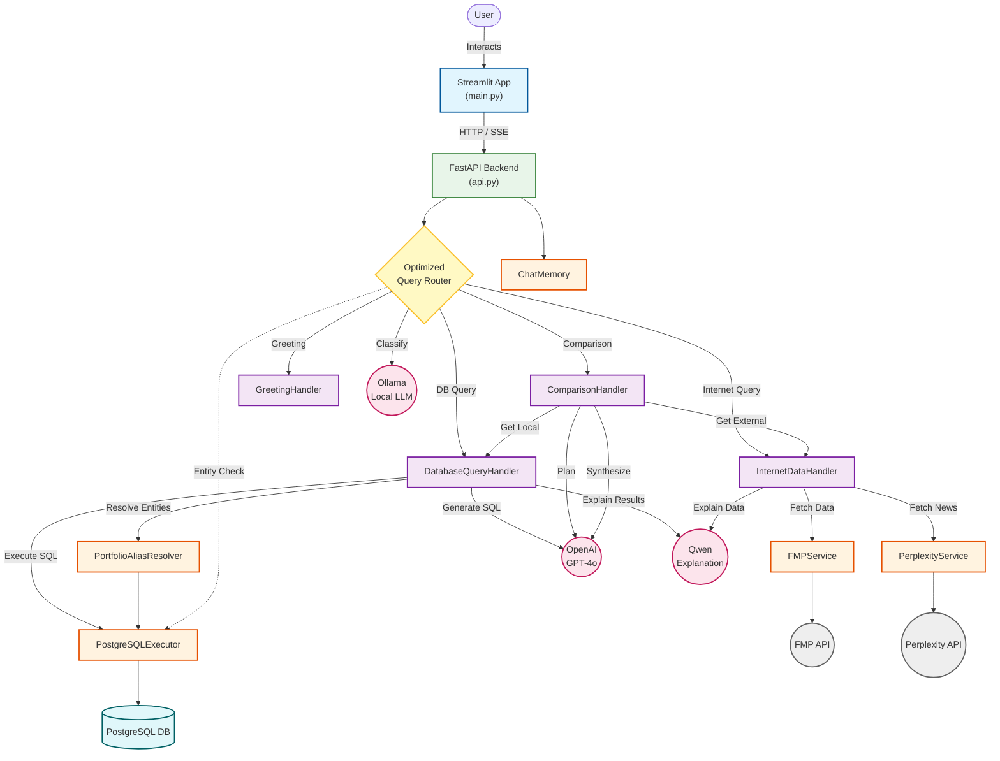

# TraderBot Solution Architecture

This document describes the high-level architecture of the TraderBot application, a financial assistant that combines local portfolio data with real-time internet market data using LLMs.

## Architecture Graph

## Component Overview

### 1. Frontend (Streamlit)
- **File**: `main.py`
- **Role**: Provides a chat interface for the user.
- **Features**:
  - Handles user input.
  - Displays streaming responses (SSE).
  - Renders Markdown tables and SQL queries.
  - Manages session state and chat history.

### 2. Backend API (FastAPI)
- **File**: `api.py`
- **Role**: Exposes REST endpoints for the frontend.
- **Key Endpoints**:
  - `/query/stream`: Unified streaming endpoint.
  - `/initialize`: Sets up database and service connections.
  - `/query/classify`: Routes queries to appropriate handlers.

### 3. Query Router
- **File**: `src/services/gpt_oss_query_router_v2.py`
- **Role**: Classifies user queries into categories to determine the processing path.
- **Mechanism**:
  1.  **Tier 1**: Regex patterns (Instant).
  2.  **Tier 2**: Keyword/Entity matching (Fast).
  3.  **Tier 3**: LLM (Ollama) fallback (Slow/Accurate).
- **Categories**: `database`, `internet_data`, `comparison`, `greeting`.

### 4. Handlers
Handlers contain the core business logic for each query type.

- **DatabaseQueryHandler** (`src/services/database_handler.py`):
  - Resolves privacy-preserving aliases (using `PortfolioAliasResolver`).
  - Generates SQL queries using **OpenAI**.
  - Executes queries against **PostgreSQL**.
  - Explains results using **Qwen** (via OpenAI-compatible API).

- **InternetDataHandler** (`src/services/internet_data_handler.py`):
  - Fetches real-time market data, crypto, forex, and news.
  - Integration with **Financial Modeling Prep (FMP)** for structured data.
  - Integration with **Perplexity** for news and research.
  - Explains findings using **Qwen**.

- **ComparisonHandler** (`src/services/comparison_handler.py`):
  - Orchestrates complex queries requiring both local and external data.
  - Uses **OpenAI** to plan the comparison.
  - Calls `DatabaseQueryHandler` and `InternetDataHandler` in parallel.
  - Synthesizes a comparative response using **OpenAI**.

### 5. Services & Utilities
- **PostgreSQLExecutor**: Manages database connections and query execution.
- **PortfolioAliasResolver**: Maps user-friendly names to database IDs (and anonymizes them for the LLM).
- **ChatMemory**: Manages conversation context for follow-up questions.
