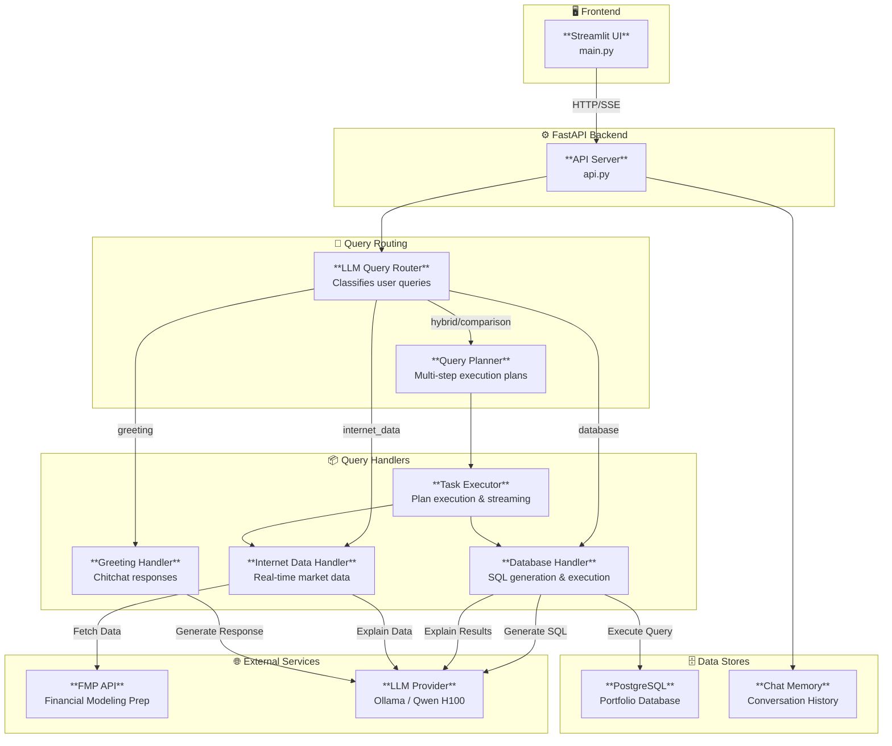
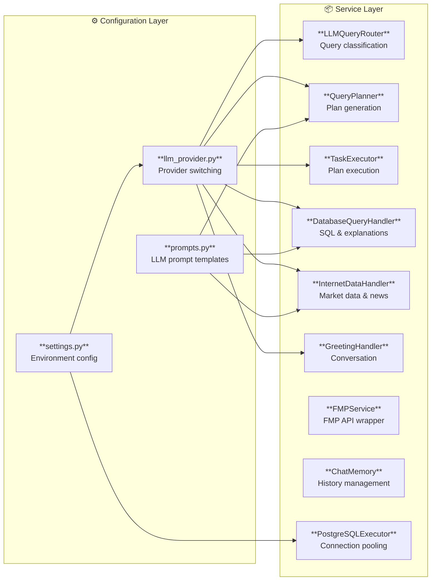
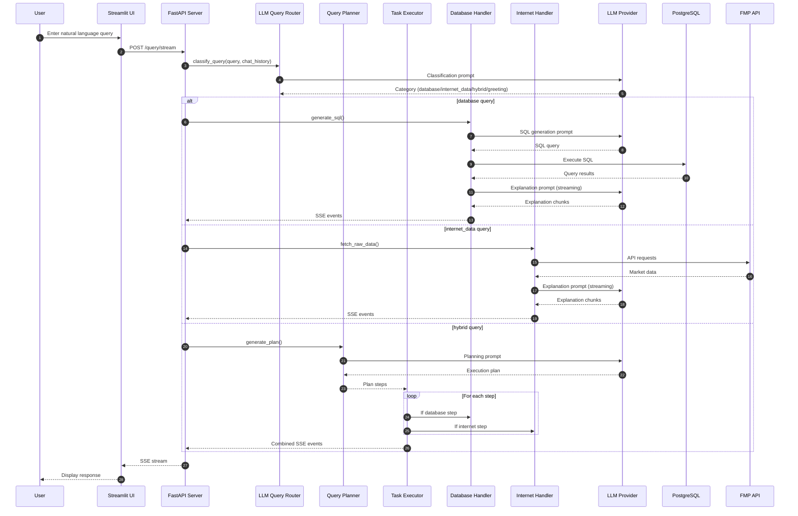
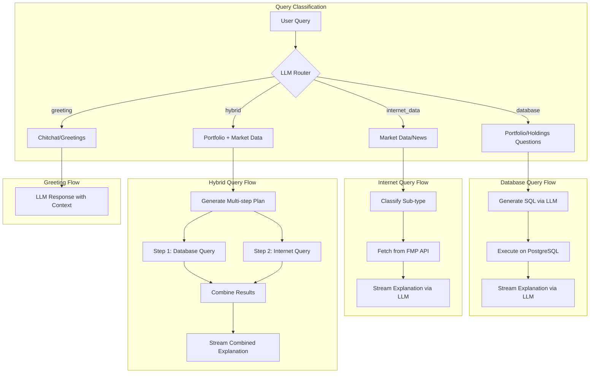
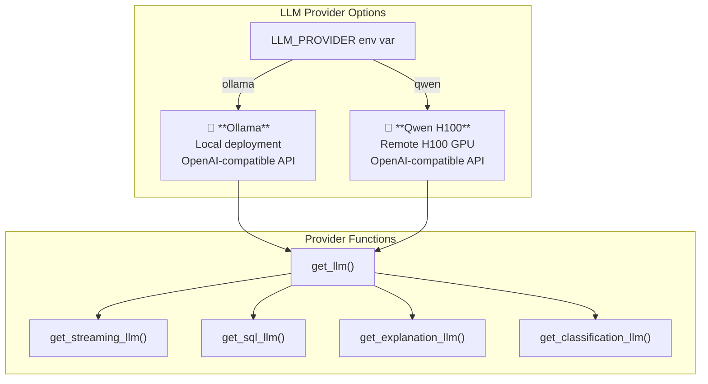
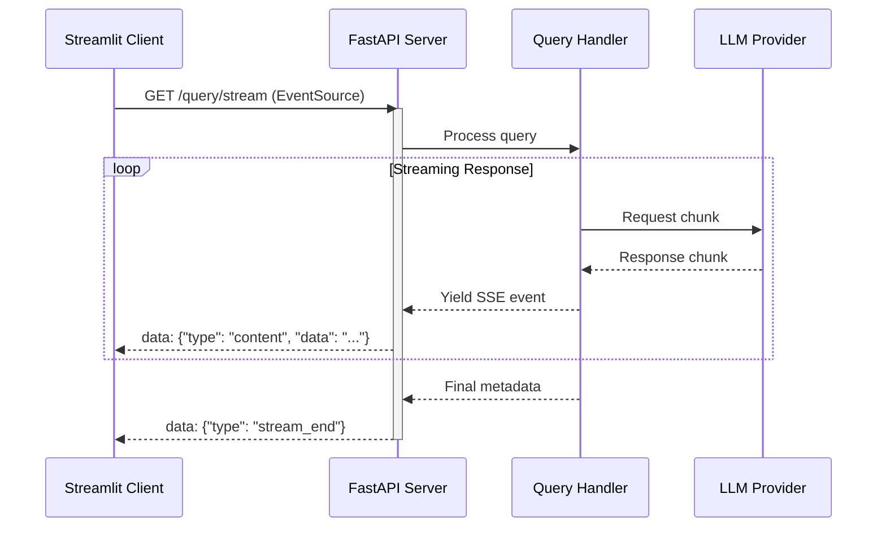

# TraderBot System Architecture

## Overview

TraderBot is a natural language financial assistant that enables users to query portfolio databases, fetch real-time market data, and receive AI-powered explanations. The system uses a Streamlit frontend, FastAPI backend, and configurable LLM providers (Ollama or Qwen H100).

---

## High-Level Architecture



---

## Component Details



---

## Request Flow Diagram



---

## Data Flow for Query Types



---

## LLM Provider Configuration



---

## File Structure Overview

```
TraderBot/
├── main.py                    # Streamlit UI frontend
├── api.py                     # FastAPI backend server
├── test2sql_prompt.md         # SQL generation prompt template
│
├── src/
│   ├── config/
│   │   ├── llm_provider.py    # LLM provider switching (Ollama/Qwen)
│   │   ├── settings.py        # Environment configuration
│   │   └── prompts.py         # LLM prompt templates
│   │
│   ├── services/
│   │   ├── llm_query_router.py      # Query classification
│   │   ├── query_planner.py         # Multi-step plan generation
│   │   ├── task_executor.py         # Plan execution with streaming
│   │   ├── database_handler.py      # SQL generation & explanations
│   │   ├── internet_data_handler.py # Real-time market data
│   │   ├── greating_handler.py      # Chitchat responses
│   │   ├── fmp_service.py           # FMP API wrapper
│   │   ├── chat_memory.py           # Conversation history
│   │   └── sql_utilities.py         # PostgreSQL connection pooling
│   │
│   └── utils/
│       ├── response_cleaner.py      # LLM response formatting
│       └── toon_formatter.py        # Token-efficient data formatting
│
└── docs/
    └── system_architecture.md       # This file
```

---

## Key Technologies

| Component | Technology |
|-----------|------------|
| Frontend | Streamlit |
| Backend | FastAPI |
| Database | PostgreSQL |
| LLM Providers | Ollama (local), Qwen H100 (remote) |
| LLM Framework | LangChain |
| Market Data | Financial Modeling Prep API |
| Streaming | Server-Sent Events (SSE) |
| Connection Pool | psycopg2 ThreadedConnectionPool |

---

## Streaming Architecture



---

*Generated: 2026-01-08*
