# TraderBot System Architecture

## Overview

TraderBot is a natural language financial assistant that enables users to query portfolio databases, fetch real-time market data, and receive AI-powered explanations. The system uses a Streamlit frontend, FastAPI backend, and configurable LLM providers (Ollama or Qwen H100).

---

## High-Level Architecture


---

## Component Details

```mermaid
flowchart LR
    subgraph Config["⚙️ Configuration Layer"]
        direction TB
        LLMProvider["**llm_provider.py**<br/>Provider switching"]
        Settings["**settings.py**<br/>Environment config"]
        Prompts["**prompts.py**<br/>LLM prompt templates"]
    end

    subgraph Services["📦 Service Layer"]
        direction TB
        LLMRouter["**LLMQueryRouter**<br/>Query classification"]
        QueryPlanner["**QueryPlanner**<br/>Plan generation"]
        TaskExecutor["**TaskExecutor**<br/>Plan execution"]
        DBHandler["**DatabaseQueryHandler**<br/>SQL & explanations"]
        InternetHandler["**InternetDataHandler**<br/>Market data & news"]
        GreetHandler["**GreetingHandler**<br/>Conversation"]
        FMPService["**FMPService**<br/>FMP API wrapper"]
        ChatMemory["**ChatMemory**<br/>History management"]
        SQLUtils["**PostgreSQLExecutor**<br/>Connection pooling"]
    end

    LLMProvider --> LLMRouter
    LLMProvider --> QueryPlanner
    LLMProvider --> TaskExecutor
    LLMProvider --> DBHandler
    LLMProvider --> InternetHandler
    LLMProvider --> GreetHandler

    Settings --> LLMProvider
    Settings --> SQLUtils
    Prompts --> DBHandler
    Prompts --> InternetHandler
    Prompts --> QueryPlanner
```



---

## Request Flow Diagram


---

## Data Flow for Query Types


---

## LLM Provider Configuration

```mermaid
flowchart TB
    subgraph Providers["LLM Provider Options"]
        ENV["LLM_PROVIDER env var"]
        ENV -->|"ollama"| Ollama["🦙 **Ollama**<br/>Local deployment<br/>OpenAI-compatible API"]
        ENV -->|"qwen"| Qwen["🚀 **Qwen H100**<br/>Remote H100 GPU<br/>OpenAI-compatible API"]
    end

    subgraph Functions["Provider Functions"]
        GetLLM["get_llm()"]
        GetStreaming["get_streaming_llm()"]
        GetSQL["get_sql_llm()"]
        GetExplanation["get_explanation_llm()"]
        GetClassification["get_classification_llm()"]
    end

    Ollama --> GetLLM
    Qwen --> GetLLM
    GetLLM --> GetStreaming
    GetLLM --> GetSQL
    GetLLM --> GetExplanation
    GetLLM --> GetClassification
```



---

## File Structure Overview

```
TraderBot/
├── main.py                    # Streamlit UI frontend
├── api.py                     # FastAPI backend server
├── test2sql_prompt.md         # SQL generation prompt template
│
├── src/
│   ├── config/
│   │   ├── llm_provider.py    # LLM provider switching (Ollama/Qwen)
│   │   ├── settings.py        # Environment configuration
│   │   └── prompts.py         # LLM prompt templates
│   │
│   ├── services/
│   │   ├── llm_query_router.py      # Query classification
│   │   ├── query_planner.py         # Multi-step plan generation
│   │   ├── task_executor.py         # Plan execution with streaming
│   │   ├── database_handler.py      # SQL generation & explanations
│   │   ├── internet_data_handler.py # Real-time market data
│   │   ├── greating_handler.py      # Chitchat responses
│   │   ├── fmp_service.py           # FMP API wrapper
│   │   ├── chat_memory.py           # Conversation history
│   │   └── sql_utilities.py         # PostgreSQL connection pooling
│   │
│   └── utils/
│       ├── response_cleaner.py      # LLM response formatting
│       └── toon_formatter.py        # Token-efficient data formatting
│
└── docs/
    └── system_architecture.md       # This file
```

---

## Key Technologies

| Component | Technology |
|-----------|------------|
| Frontend | Streamlit |
| Backend | FastAPI |
| Database | PostgreSQL |
| LLM Providers | Ollama (local), Qwen H100 (remote) |
| LLM Framework | LangChain |
| Market Data | Financial Modeling Prep API |
| Streaming | Server-Sent Events (SSE) |
| Connection Pool | psycopg2 ThreadedConnectionPool |

---

## Streaming Architecture


---

*Generated: 2026-01-08*
